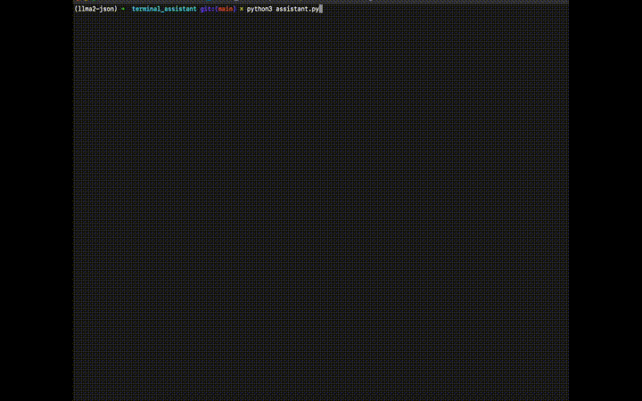

### 1. [Terminal Assistant](./terminal_assistant/)
> An AI assistant that can answer your simple questions. Has no memory, so won't rmember your previous question.   

- Powered by llama2.
##### Local Setup:
1. Install [Ollama](https://ollama.ai)
2. Pull & run the llama2 model locally
```bash
ollama run llama2
```
3. clone this repo, cd into the cloned repository & create a virtual environment
```bash
python3 -m venv venv
source venv/bin/activate
```
4. Install the required packages
```bash
pip install -r requirements.txt
```
5. cd into `terminal_assistant` directory & Run the assistant
```bash
python3 assistant.py
```
#### Demo:
